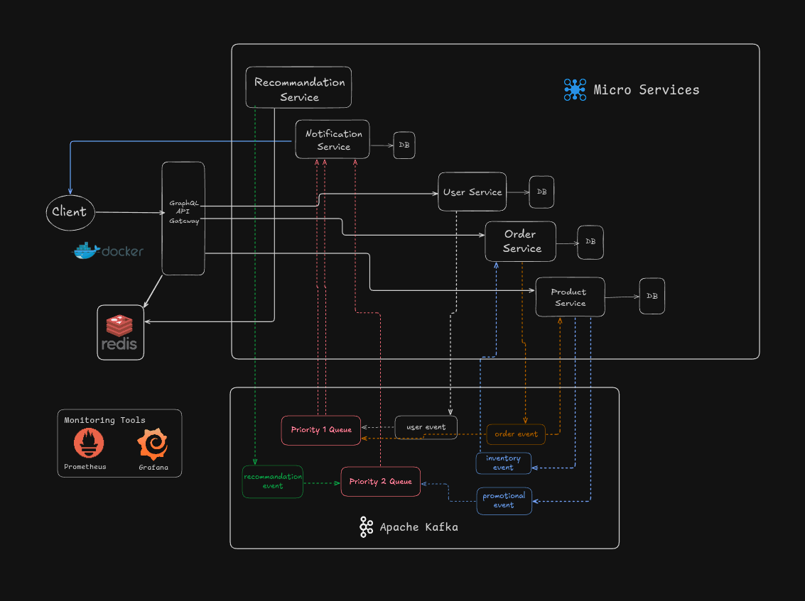

# Microservices Backend System

## Overview
This project is a **scalable, event-driven microservices-based backend** designed to support the complex operations of an e-commerce platform. It consists of multiple independent services, each with its own database, connected asynchronously through **Kafka** and exposing APIs via **GraphQL**. The system is built with a strong focus on **performance, reliability, and scalability**, featuring **Redis caching**, **JWT authentication**, **priority-based notification handling**, and **observability** through monitoring tools like **Prometheus and Grafana**. The containerized architecture ensures seamless deployment and management.

## Architecture



- **Microservices**: Independent services for handling **User**, **Product**, **Order**, **Notification**, and **Recommendation** functionalities.
- **GraphQL API**: A unified interface enabling efficient and flexible data querying across multiple services.
- **Event-Driven Communication**: Kafka-based asynchronous messaging for real-time updates and service decoupling.
- **Redis Caching**: Accelerates response times by caching frequently accessed resources and recommendations.
- **Authentication & Security**: Secure access using **JWT-based authentication** and role-based authorization.
- **Monitoring & Observability**: Integrated monitoring with **Prometheus** and **Grafana** for health checks and centralized logging.
- **Containerized Deployment**: Services are containerized using **Docker Compose** for streamlined deployment and scaling.

## Features

### **User Management**
- User registration and authentication with secure JWT-based access control.

### **Product Catalog**
- Endpoints for creating, updating, and managing product details.
- Real-time inventory tracking and updates.

### **Order Processing**
- Real-time order placement with status updates.
- Inventory reservation system to prevent overselling and ensure consistency.

### **Event-Driven Architecture**
- Kafka-driven real-time communication between services.
- Dead Letter Queues (DLQs) for error handling and message recovery.
- Enhanced resilience and fault tolerance.

### **GraphQL API**
- Consolidated API for querying data across services with flexibility and efficiency.
- Integrated caching of GraphQL responses in Redis for improved query performance.

### **Response Caching**
- Frequently accessed data (e.g., product listings, recommendations) cached in Redis.
- Intelligent cache invalidation for inventory updates and recommendation updates.
- Optimized caching for high-demand scenarios.

### **Notification System**
- Automated email notifications for **transactional**, **promotional**, and **recommendation-based** messages.
- Priority-based queues:
  - **Critical Queue**: For high-priority notifications like order updates and security alerts.
  - **Standard Queue**: For lower-priority notifications like promotional emails.
- Cron jobs for scheduled or bulk notifications to improve efficiency.
- Event-driven triggers for sending notifications seamlessly.

### **Recommendation Engine**
- Efficient, rule-based recommendation engine using order history.
- Personalized suggestions based on past user behavior.
- Cached recommendations for faster response and reduced compute overhead.

### **Monitoring & Observability**
- **Prometheus** for real-time metrics collection and monitoring.
- **Grafana** dashboards for visualizing system health, performance, and analytics.
- Centralized logging for improved debugging and auditing.

### **Containerization**
- Fully containerized system using **Docker** for seamless deployment.
- Orchestration with **Docker Compose** to run all services together or individually for debugging.

## Tech Stack

### **Backend Services**
- **Node.js** with **Express.js** (Service APIs)
- **GraphQL** (API Gateway for unified data querying)
- **Kafka** (Event Streaming for service communication)
- **Redis** (Key/Value caching and Pub/Sub)
- **MongoDB** (NoSQL database for each service)
- **JWT Authentication** (Secure token-based access)
- **Nodemailer / SMTP** (Email notification service)

### **Infrastructure & DevOps**
- **Docker & Docker Compose** (Containerization and orchestration)
- **Prometheus** (Metrics collection and monitoring)
- **Grafana** (Dashboard visualization and analytics)

## Running Locally
The entire system can be run locally with a single command using Docker Compose.

### **Prerequisites**
- Install **Docker** and **Docker Compose**.
- Configure environment variables (`.env`) for each service.

### **Start the System**
Run all services together using Docker Compose:
```bash
docker-compose up --build
